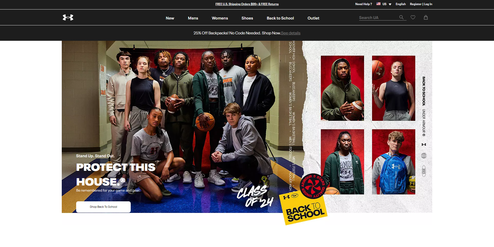
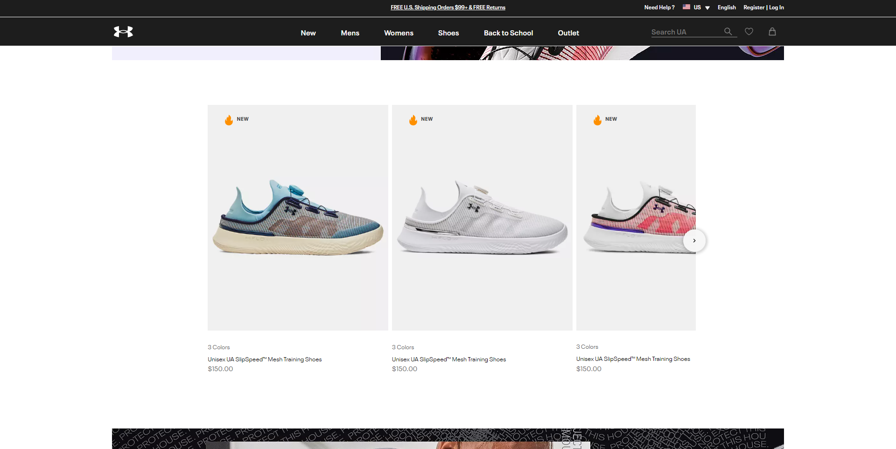
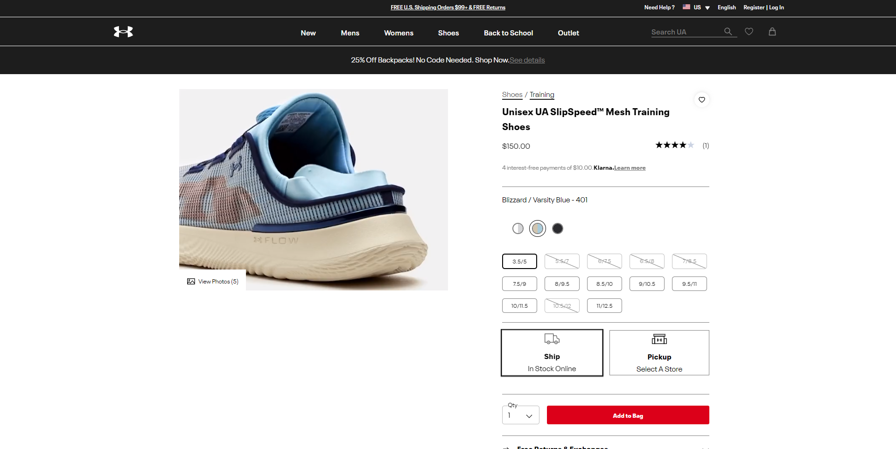
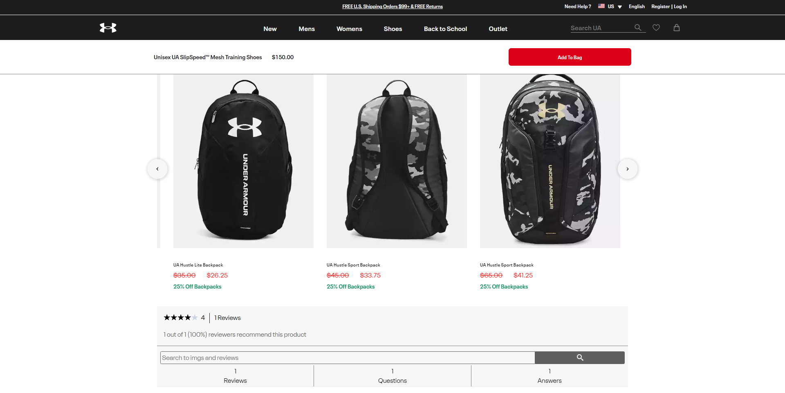

# UA-Clone

## Getting Started

Built using Nextjs and React

## Deployed on vercel click [here](http://under-armour-clone-uncor3.vercel.app/) also available on [codeSandBox](https://codesandbox.io/p/github/UnCor3/Under-Armour-clone/main?import=true&layout=%257B%2522sidebarPanel%2522%253A%2522GIT%2522%252C%2522rootPanelGroup%2522%253A%257B%2522direction%2522%253A%2522horizontal%2522%252C%2522contentType%2522%253A%2522UNKNOWN%2522%252C%2522type%2522%253A%2522PANEL_GROUP%2522%252C%2522id%2522%253A%2522ROOT_LAYOUT%2522%252C%2522panels%2522%253A%255B%257B%2522type%2522%253A%2522PANEL_GROUP%2522%252C%2522contentType%2522%253A%2522UNKNOWN%2522%252C%2522direction%2522%253A%2522vertical%2522%252C%2522id%2522%253A%2522clq5wt0ad01ks356k5t6jxvsg%2522%252C%2522sizes%2522%253A%255B70%252C30%255D%252C%2522panels%2522%253A%255B%257B%2522type%2522%253A%2522PANEL_GROUP%2522%252C%2522contentType%2522%253A%2522EDITOR%2522%252C%2522direction%2522%253A%2522horizontal%2522%252C%2522id%2522%253A%2522EDITOR%2522%252C%2522panels%2522%253A%255B%257B%2522type%2522%253A%2522PANEL%2522%252C%2522contentType%2522%253A%2522EDITOR%2522%252C%2522id%2522%253A%2522clq5wt0ad01kp356k7aorb46t%2522%257D%255D%257D%252C%257B%2522type%2522%253A%2522PANEL_GROUP%2522%252C%2522contentType%2522%253A%2522SHELLS%2522%252C%2522direction%2522%253A%2522horizontal%2522%252C%2522id%2522%253A%2522SHELLS%2522%252C%2522panels%2522%253A%255B%257B%2522type%2522%253A%2522PANEL%2522%252C%2522contentType%2522%253A%2522SHELLS%2522%252C%2522id%2522%253A%2522clq5wt0ad01kr356keanxpugd%2522%257D%255D%252C%2522sizes%2522%253A%255B100%255D%257D%255D%257D%252C%257B%2522type%2522%253A%2522PANEL_GROUP%2522%252C%2522contentType%2522%253A%2522DEVTOOLS%2522%252C%2522direction%2522%253A%2522vertical%2522%252C%2522id%2522%253A%2522DEVTOOLS%2522%252C%2522panels%2522%253A%255B%257B%2522type%2522%253A%2522PANEL%2522%252C%2522contentType%2522%253A%2522DEVTOOLS%2522%252C%2522id%2522%253A%2522clq5wt0ad01kq356ku98ks7ci%2522%257D%255D%252C%2522sizes%2522%253A%255B100%255D%257D%255D%252C%2522sizes%2522%253A%255B50%252C50%255D%257D%252C%2522tabbedPanels%2522%253A%257B%2522clq5wt0ad01kp356k7aorb46t%2522%253A%257B%2522id%2522%253A%2522clq5wt0ad01kp356k7aorb46t%2522%252C%2522activeTabId%2522%253A%2522clq5yi1c2034f356kcq0018of%2522%252C%2522tabs%2522%253A%255B%257B%2522id%2522%253A%2522clq5wo0d6005d356k1fdc6c86%2522%252C%2522mode%2522%253A%2522permanent%2522%252C%2522type%2522%253A%2522FILE%2522%252C%2522filepath%2522%253A%2522%252FREADME.md%2522%252C%2522state%2522%253A%2522IDLE%2522%257D%252C%257B%2522type%2522%253A%2522FILE%2522%252C%2522filepath%2522%253A%2522%252F.codesandbox%252Ftasks.json%2522%252C%2522id%2522%253A%2522clq5yi1c2034f356kcq0018of%2522%252C%2522mode%2522%253A%2522permanent%2522%252C%2522state%2522%253A%2522IDLE%2522%257D%255D%257D%252C%2522clq5wt0ad01kq356ku98ks7ci%2522%253A%257B%2522id%2522%253A%2522clq5wt0ad01kq356ku98ks7ci%2522%252C%2522tabs%2522%253A%255B%257B%2522type%2522%253A%2522UNASSIGNED_PORT%2522%252C%2522port%2522%253A3000%252C%2522id%2522%253A%2522clq5wqeiq00sd356k13ta5y9i%2522%252C%2522mode%2522%253A%2522permanent%2522%252C%2522path%2522%253A%2522%252F%2522%257D%252C%257B%2522type%2522%253A%2522TASK_PORT%2522%252C%2522taskId%2522%253A%2522sandbox%2522%252C%2522port%2522%253A3000%252C%2522id%2522%253A%2522clq5yhv82030p356kv0lxbyeo%2522%252C%2522mode%2522%253A%2522permanent%2522%252C%2522path%2522%253A%2522%252F%2522%257D%255D%252C%2522activeTabId%2522%253A%2522clq5yhv82030p356kv0lxbyeo%2522%257D%252C%2522clq5wt0ad01kr356keanxpugd%2522%253A%257B%2522id%2522%253A%2522clq5wt0ad01kr356keanxpugd%2522%252C%2522activeTabId%2522%253A%2522clq5ykn5u005q356kd5smtgx3%2522%252C%2522tabs%2522%253A%255B%257B%2522id%2522%253A%2522clq5wdvwr0003356k0wv2buwc%2522%252C%2522mode%2522%253A%2522permanent%2522%252C%2522type%2522%253A%2522TERMINAL%2522%252C%2522shellId%2522%253A%2522clq5wy3wt000fefht1lbt90pt%2522%257D%252C%257B%2522type%2522%253A%2522TASK_LOG%2522%252C%2522taskId%2522%253A%2522sandbox%2522%252C%2522id%2522%253A%2522clq5ykn5u005q356kd5smtgx3%2522%252C%2522mode%2522%253A%2522permanent%2522%257D%255D%257D%257D%252C%2522showDevtools%2522%253Atrue%252C%2522showShells%2522%253Atrue%252C%2522showSidebar%2522%253Atrue%252C%2522sidebarPanelSize%2522%253A14.010416666666671%257D) but if you want to view on local clone the repo then do

```bash
npm install
# or
yarn add
```

lastly do

```bash
npm run dev
# or
yarn dev
```

# Disclaimer: This website is a personal project created for educational and non-commercial purposes. I do not own, represent, or have any affiliation with Under Armour or its associated trademarks, logos, or copyrighted materials. All rights, trademarks, and copyrights related to Under Armour and its products are the property of their respective owners.

As can be expected page content is different (products,promos,landing page etc) and i skipped on some futures

Open [http://localhost:3000](http://localhost:3000) on your browser to see the app.

Here are some previews from the web app.

<div style="margin-bottom:3rem">
    <video src="public/videos/repo-preview.mp4" autoplay loop >
    </video>
</div>
<div>
    
    
    
    
</div>
